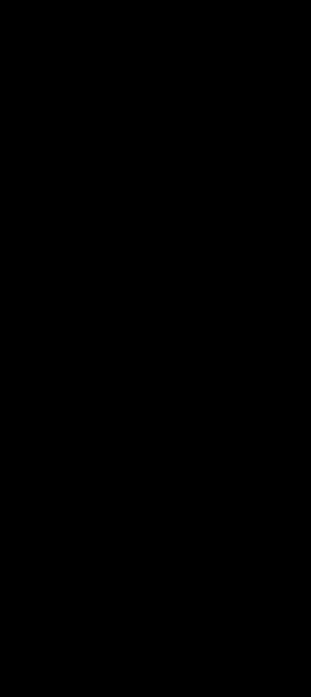
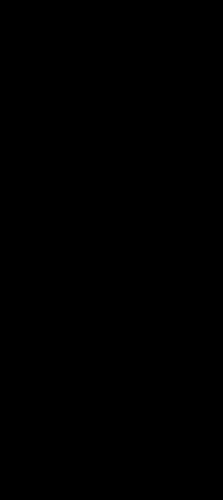
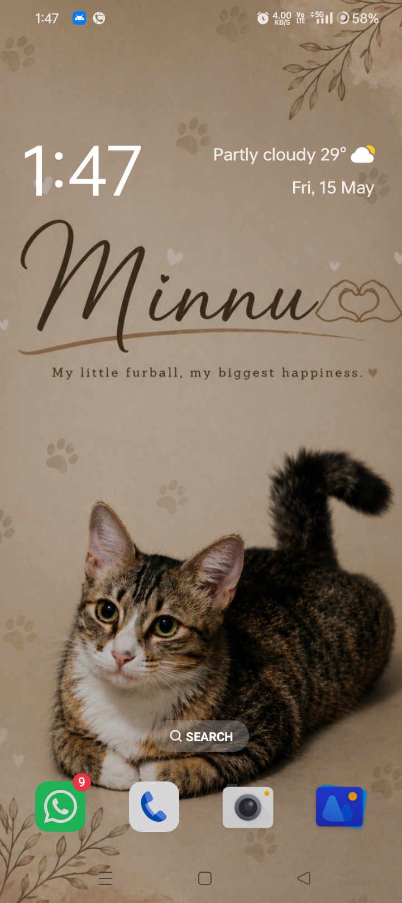
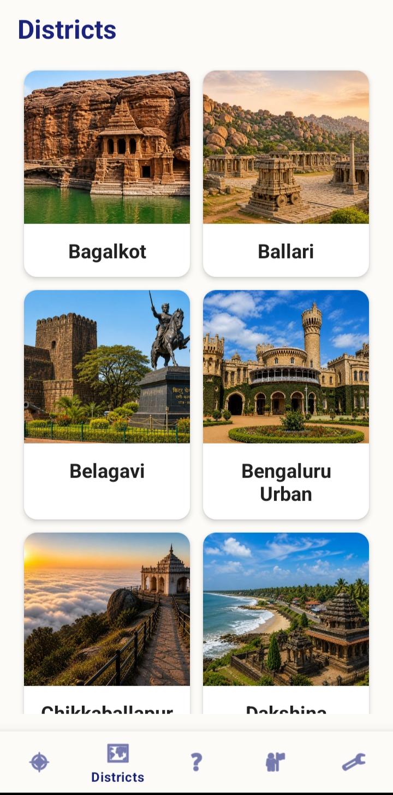
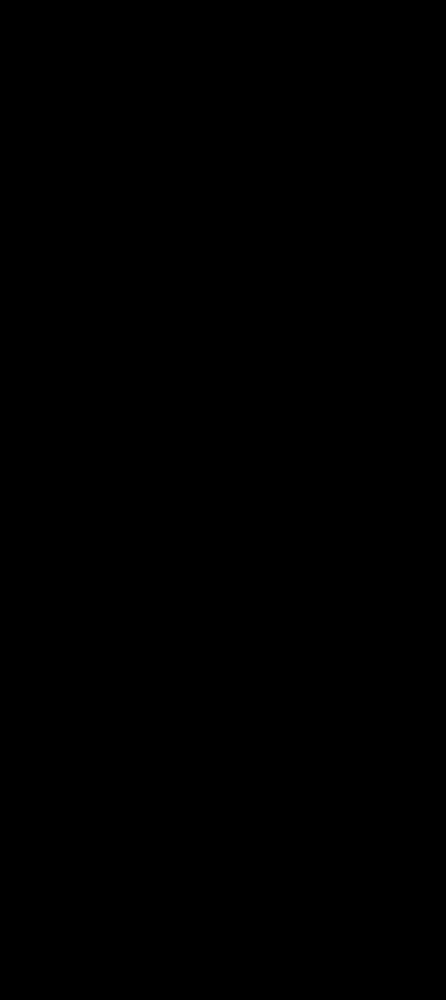
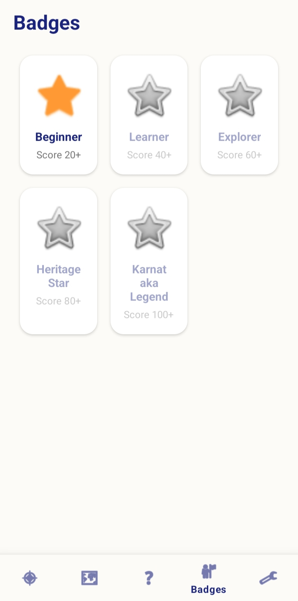

# Namma-Kathey: Karnataka Heritage Explorer

**Namma-Kathey** (Our Story) is a comprehensive Android application designed to promote the rich history and heritage of Karnataka. The app allows users to explore various districts, learn about local heroes, poets, and social reformers through engaging stories, and test their knowledge via interactive quizzes.

---

## 📸 Screenshots

| Splash Screen | Login / Register | Home Dashboard |
|---|---|---|
|  |  |  |

| District Explorer | Storybook View | Quiz & Badges |
|---|---|---|
|  |  |  |

> *Note: Screenshots represent the current state of the application.*

---

## ✨ Features

- **Explore Districts:** Navigate through the various districts of Karnataka, each with unique descriptions and featured heroes.
- **Hero Biographies:** Detailed stories of legendary figures like Kittur Rani Chennamma, Sangolli Rayanna, Kuvempu, and more.
- **Interactive Storybook:** A paginated reader with **Text-To-Speech (TTS)** support in both English and Kannada.
- **Multilingual Support:** Seamlessly switch between **English** and **Kannada** languages throughout the app.
- **Gamified Learning:** 
    - Interactive quizzes for every hero.
    - Heritage Score system to track progress.
    - Unlockable Badges (Beginner, Learner, Explorer, Heritage Star, Karnataka Legend).
- **Secure Authentication:** User login and registration powered by **Firebase Auth**.
- **Real-time Data:** Integration with **Firebase Firestore** for dynamic content delivery.

---

## 🛠️ Technology Stack

- **Language:** Kotlin
- **UI Framework:** Android ViewBinding & XML
- **Architecture:** MVVM (Model-View-ViewModel)
- **Backend:** 
    - Firebase Authentication
    - Cloud Firestore
- **Libraries:**
    - **Glide:** Efficient image loading.
    - **Gson:** JSON data handling.
    - **Navigation Component:** Seamless fragment transitions.
    - **Text-To-Speech API:** Native Android TTS for accessibility.

---

## 🚀 Getting Started

### Prerequisites
- Android Studio Iguana or newer.
- JDK 17 or 18.
- A physical Android device or Emulator (API Level 24+).

### Installation
1. **Clone the repository:**
   ```bash
   git clone https://github.com/bibisakina/Namma-Kathey.git
   ```
2. **Open in Android Studio:**
   Select "Open" and navigate to the cloned folder.
3. **Firebase Setup:**
   - Create a project on the [Firebase Console](https://console.firebase.google.com/).
   - Add an Android App with package name `com.nammakathey.app`.
   - Download `google-services.json` and place it in the `app/` directory.
   - Enable Email/Password Auth and Firestore in the Firebase console.
4. **Sync & Build:**
   Let Gradle sync finish and click the "Run" button.

---

## 📂 Project Structure

```text
app/src/main/java/com/nammakathey/app/
├── data/           # Data models, DataSources, and Repository
├── ui/             # Activities, Fragments, and ViewModels
│   ├── auth/       # Login and Registration
│   ├── hero/       # Hero lists and detail views
│   ├── quiz/       # Interactive quiz engine
│   ├── storybook/  # Pager-based story reader
│   └── main/       # Home, Profile, and Dashboard
└── utils/          # Session management and helpers
```

---

## 🤝 Contributing
Contributions are welcome! Feel free to fork the repo and submit a pull request for any new features or bug fixes related to Karnataka's history.

---

## 📝 License
This project is licensed under the MIT License - see the [LICENSE](LICENSE) file for details.

---

## 🌟 Acknowledgements
- Inspired by the rich cultural history of Karnataka.
- Icons and assets curated for educational purposes.
